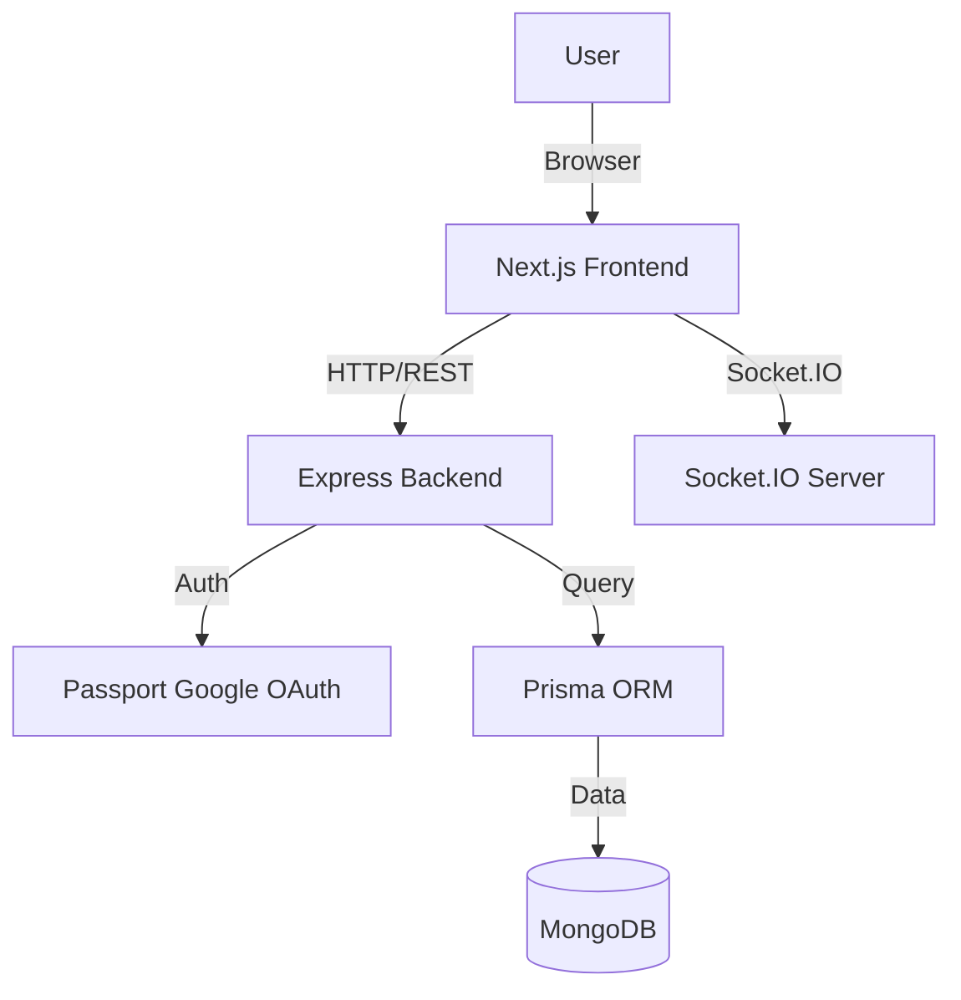

# AlumniConnect


> **Bridging the gap between students and alumni.**

AlumniConnect is a comprehensive platform designed to foster mentorship, networking, and professional growth. It addresses the challenge of disconnected alumni networks by providing a dedicated, feature-rich space for interaction, knowledge sharing, and career guidance.

---

## 📑 Table of Contents

- [Features](#-features)
- [System Architecture](#-system-architecture)
- [Tech Stack](#-tech-stack)
- [Getting Started](#-getting-started)
  - [Prerequisites](#prerequisites)
  - [Installation](#installation)
  - [Environment Variables](#environment-variables)
- [API Documentation](#-api-documentation)
- [Database Schema](#-database-schema)
- [Project Structure](#-project-structure)
- [Contributing](#-contributing)
- [License](#-license)

---

## ✨ Features

- **🔐 Secure Authentication**: Robust Google OAuth integration with Passport.js and JWT-based session management.
- **👥 Role-Based Profiles**: Distinct profiles for **Students** (academic details) and **Alumni** (professional history).
- **💬 Real-time Communication**: Instant messaging and chat rooms powered by Socket.IO.
- **📝 Community Feed**: Share updates, achievements, and opportunities with a rich text posting system.
- **🛡️ Route Protection**: Secure frontend guards ensuring privacy and authorized access.
- **🔍 Advanced Search**: Find peers and mentors easily with optimized search functionality.

---

## 🏗 System Architecture



---

## 💻 Tech Stack

### Frontend
- **Framework**: [Next.js 15](https://nextjs.org/) (App Router)
- **Styling**: Tailwind CSS, Framer Motion
- **State Management**: React Context API
- **HTTP Client**: Axios / Fetch API

### Backend
- **Runtime**: Node.js
- **Framework**: Express.js
- **Database**: MongoDB
- **ORM**: Prisma
- **Authentication**: Passport.js (Google Strategy), JWT
- **Real-time**: Socket.IO

---

## 🚀 Getting Started

### Prerequisites

Ensure you have the following installed:
- **Node.js** (v18 or higher)
- **npm** or **yarn**
- **MongoDB** (Local instance or Atlas URI)

### Installation

1.  **Clone the repository**
    ```bash
    git clone https://github.com/yourusername/AlumniConnect.git
    cd AlumniConnect
    ```

2.  **Backend Setup**
    ```bash
    cd backend
    npm install
    # Start the server
    npm start
    ```
    > The backend server will start on port `3001`.

3.  **Frontend Setup**
    ```bash
    cd frontend
    npm install
    # Start the development server
    npm run dev
    ```
    > The frontend application will be accessible at `http://localhost:3000`.

### Environment Variables

Create a `.env` file in the `backend` directory with the following configuration:

| Variable | Description | Example |
| :--- | :--- | :--- |
| `DATABASE_URL` | MongoDB Connection String | `mongodb+srv://...` |
| `PORT` | Backend Port | `3001` |
| `JWT_SECRET` | Secret for signing JWTs | `your_super_secret_key` |
| `GOOGLE_CLIENT_ID` | Google OAuth Client ID | `...apps.googleusercontent.com` |
| `GOOGLE_CLIENT_SECRET` | Google OAuth Client Secret | `GOCSPX-...` |
| `CLIENT_URL` | Frontend URL | `http://localhost:3000` |

---

## 📖 API Documentation

### Auth & Users

| Method | Endpoint | Description | Auth Required |
| :--- | :--- | :--- | :---: |
| `GET` | `/auth/google` | Initiate Google OAuth | ❌ |
| `GET` | `/auth/google/callback` | Google OAuth Callback | ❌ |
| `GET` | `/api/users/me` | Get current user details | ✅ |
| `PUT` | `/api/users/set-role` | Set user role (STUDENT/ALUMNI) | ✅ |
| `POST` | `/api/users/profile` | Create/Update Profile | ✅ |
| `GET` | `/api/users/:id` | Get user by ID | ❌ |

### Posts

| Method | Endpoint | Description | Auth Required |
| :--- | :--- | :--- | :---: |
| `POST` | `/posts` | Create a new post | ✅ |
| `GET` | `/posts` | Get all posts | ❌ |
| `GET` | `/posts/:id` | Get post by ID | ❌ |
| `PATCH` | `/posts/:id/like` | Like a post | ✅ |
| `DELETE` | `/posts/:id` | Delete a post | ✅ |

---

## 🗄 Database Schema

The project uses **Prisma** with MongoDB. Below is a simplified view of the core models:

```prisma
model User {
  id              String       @id @default(auto()) @map("_id") @db.ObjectId
  name            String
  email           String       @unique
  role            Role?        // STUDENT or ALUMNI
  
  // Role-specific fields
  graduationYear  Int?
  company         String?
  
  // Relations
  posts           Post[]
  createdAt       DateTime     @default(now())
}

model Post {
  id        String    @id @default(auto()) @map("_id") @db.ObjectId
  authorId  String    @db.ObjectId
  author    User      @relation(fields: [authorId], references: [id])
  title     String
  content   String
  likes     Int       @default(0)
  createdAt DateTime  @default(now())
}
```

---

## 📂 Project Structure

```
.
├── backend
│   ├── controllers      # Business logic
│   ├── prisma           # Database schema & client
│   ├── routes           # API route definitions
│   ├── src
│   │   └── features     # Modular feature architecture
│   └── index.js         # Server entry point
├── frontend
│   ├── src
│   │   ├── app          # Next.js App Router pages
│   │   ├── components   # Reusable UI components
│   │   └── context      # Global state (UserContext)
│   └── package.json
└── README.md
```

---

## 🤝 Contributing

Contributions are welcome! Please follow these steps:

1.  Fork the repository.
2.  Create a new branch (`git checkout -b feature/AmazingFeature`).
3.  Commit your changes (`git commit -m 'Add some AmazingFeature'`).
4.  Push to the branch (`git push origin feature/AmazingFeature`).
5.  Open a Pull Request.

---

## 📄 License

This project is licensed under the MIT License - see the [LICENSE](LICENSE) file for details.

---

<div align="center">
  <sub>Built with ❤️ by the AlumniConnect Team</sub>
</div>
